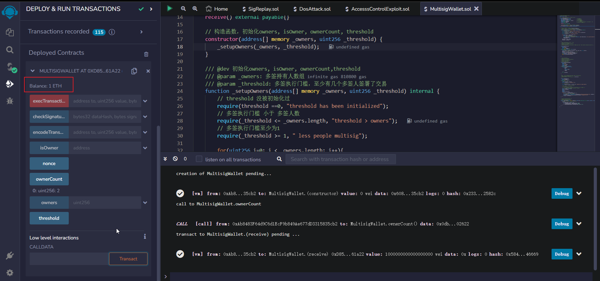
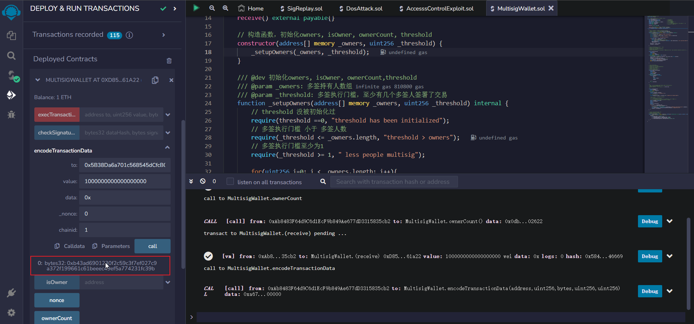
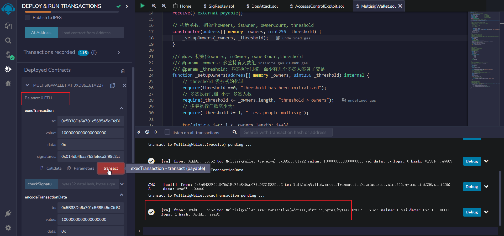

# 05. 多签钱包

V神曾说过，多签钱包要比硬件钱包更加安全（[推文](https://twitter.com/VitalikButerin/status/1558886893995134978?s=20&t=4WyoEWhwHNUtAuABEIlcRw)）。这一讲，我们将介绍多签钱包，并且写一个极简版多签钱包合约。教学代码（150行代码）由gnosis safe合约（几千行代码）简化而成。


## 多签钱包

多签钱包是一种电子钱包，特点是交易被多个私钥持有者（多签人）授权后才能执行：例如钱包由`3`个多签人管理，每笔交易需要至少`2`人签名授权。多签钱包可以防止单点故障（私钥丢失，单人作恶），更加去中心化，更加安全，被很多DAO采用。

Gnosis Safe多签钱包是以太坊最流行的多签钱包，管理近400亿美元资产，合约经过审计和实战测试，支持多链（以太坊，BSC，Polygon等），并提供丰富的DAPP支持。更多信息可以阅读我在21年12月写的[Gnosis Safe使用教程](https://peopledao.mirror.xyz/nFCBXda8B5ZxQVqSbbDOn2frFDpTxNVtdqVBXGIjj0s)。

## 多签钱包合约

在以太坊上的多签钱包其实是智能合约，属于合约钱包。下面我们写一个极简版多签钱包`MultisigWallet`合约，它的逻辑非常简单：

1. 设置多签人和门槛（链上）：部署多签合约时，我们需要初始化多签人列表和执行门槛（至少n个多签人签名授权后，交易才能执行）。Gnosis Safe多签钱包支持增加/删除多签人以及改变执行门槛，但在咱们的极简版中不考虑这一功能。

2. 创建交易（链下）：一笔待授权的交易包含以下内容

   - `to`：目标合约。
   - `value`：交易发送的以太坊数量。
   - `data`：calldata，包含调用函数的选择器和参数。
   - `nonce`：初始为`0`，随着多签合约每笔成功执行的交易递增的值，可以**防止签名重放攻击**。
   - `chainid`：链id，**防止不同链的签名重放攻击**。

3. 收集多签签名（链下）：将上一步的交易ABI编码并计算哈希，得到交易哈希，然后让多签人签名，并拼接到一起的到打包签名。

   ```
   交易哈希: 0xb43ad6901230f2c59c3f7ef027c9a372f199661c61beeec49ef5a774231fc39b
   
   多签人A签名: 0x014db45aa753fefeca3f99c2cb38435977ebb954f779c2b6af6f6365ba4188df542031ace9bdc53c655ad2d4794667ec2495196da94204c56b1293d0fbfacbb11c
   
   多签人B签名: 0xbe2e0e6de5574b7f65cad1b7062be95e7d73fe37dd8e888cef5eb12e964ddc597395fa48df1219e7f74f48d86957f545d0fbce4eee1adfbaff6c267046ade0d81c
   
   打包签名：
   0x014db45aa753fefeca3f99c2cb38435977ebb954f779c2b6af6f6365ba4188df542031ace9bdc53c655ad2d4794667ec2495196da94204c56b1293d0fbfacbb11cbe2e0e6de5574b7f65cad1b7062be95e7d73fe37dd8e888cef5eb12e964ddc597395fa48df1219e7f74f48d86957f545d0fbce4eee1adfbaff6c267046ade0d81c
   ```

4. 调用多签合约的执行函数，验证签名并执行交易（链上）。

### 事件

`MultisigWallet`合约有`2`个事件，`ExecutionSuccess`和`ExecutionFailure`，分别在交易成功和失败时释放，参数为交易哈希。

    ```js
    event ExecutionSuccess(bytes32);                  // 交易成功事件
    event ExecutionFailure(bytes32);                  // 交易失败事件
    ```


### 状态变量

`MultisigWallet`合约有`5`个状态变量：

1. `owners`：多签持有人数组

2. `isOwner`：`address => bool`的映射，记录一个地址是否为多签持有人。

3. `ownerCount`：多签持有人数量

4. `threshold`：多签执行门槛，交易至少有n个多签人签名才能被执行。

5. `nonce`：初始为`0`，随着多签合约每笔成功执行的交易递增的值，可以防止签名重放攻击。

   ```js
      address[] public owners;                   // 多签持有人数组 
       mapping(address => bool) public isOwner;   // 记录一个地址是否为多签持有人
       uint256 public ownerCount;                 // 多签持有人数量
       uint256 public threshold;                  // 多签执行门槛，交易至少有n个多签人签名才能被执行。
       uint256 public nonce;                      // nonce，防止签名重放攻击
   ```

### 函数

`MultisigWallet`合约有`6`个函数：

1. 构造函数：调用`_setupOwners()`，初始化和多签持有人和执行门槛相关的变量。

   ```js
       // 构造函数，初始化owners, isOwner, ownerCount, threshold
       constructor(address[] memory _owners, uint256 _threshold) {
           _setupOwners(_owners, _threshold);
       }
   ```

2. `_setupOwners()`：在合约部署时被构造函数调用，初始化`owners`，`isOwner`，`ownerCount`，`threshold`状态变量。传入的参数中，执行门槛需大于等于`1`且小于等于多签人数；多签地址不能为`0`地址且不能重复。

   ```js
       /// @dev 初始化owners, isOwner, ownerCount,threshold 
       /// @param _owners: 多签持有人数组
       /// @param _threshold: 多签执行门槛，至少有几个多签人签署了交易
       function _setupOwners(address[] memory _owners, uint256 _threshold) internal {
           // threshold 没被初始化过
           require(threshold ==0, "threshold has been initialized");
           // 多签执行门槛 小于 多签人数
           require(_threshold <= _owners.length, "threshold > owners");
           // 多签执行门槛至少为1
           require(_threshold >= 1, " less people multisig");
   
           for(uint256 i=0; i < _owners.length; i++){
               address owner = _owners[i];
               // 多签不能为0地址，本合约地址，地址不能重复
               require(owner != address(0) && owner != address(this) && !isOwner[owner], "not a qualified address");
               owners.push(owner);
               isOwner[owner] = true;
           }
           ownerCount = _owners.length;
           threshold = _threshold;
   
       }
   ```

3. `execTransaction()`：在收集足够的多签签名后，验证签名并执行交易。传入的参数为目标地址`to`，发送的以太坊数额`value`，数据`data`，以及打包签名`signatures`。打包签名就是将收集的多签人对交易哈希的签名，**按多签持有人地址从小到大顺序**，打包到一个[bytes]数据中。这一步调用了`encodeTransactionData()`编码交易，调用了`checkSignatures()`检验签名是否有效、数量是否达到执行门槛。

   ```js
   /// @dev 在收集足够的多签签名后，执行交易
       /// @param to 目标合约地址
       /// @param value msg.value，支付的以太坊
       /// @param data calldata
       /// @param signatures 打包的签名，对应的多签地址由小到达，方便检查。 ({bytes32 r}{bytes32 s}{uint8 v}) (第一个多签的签名, 第二个多签的签名 ... )
   
       function execTransaction(
           address to,
           uint256 value,
           bytes memory data,
           bytes memory signatures
       ) public payable virtual returns (bool success){
           // 编码交易数据，计算哈希
           bytes32 txHash = encodeTransactionData(to, value, data, nonce, block.chainid);
           nonce ++;   // 增加nonce 
           checkSignatures(txHash, signatures);  // 检查签名
           (success, ) = to.call{value: value}(data);
           require(success, " call failure ");
           if (success) emit ExecutionSuccess(txHash);
           else emit ExecutionFailure(txHash);
   
   
       }
   ```

4. `checkSignatures()`：检查签名和交易数据的哈希是否对应，数量是否达到门槛，若否，交易会revert。单个签名长度为65字节，因此打包签名的长度要长于`threshold * 65`。调用了`signatureSplit()`分离出单个签名。这个函数的大致思路：

   - 用ecdsa获取签名地址.
   - 利用 `currentOwner > lastOwner` 确定签名来自不同多签（多签地址递增）。
   - 利用`isOwner[currentOwner]`确定签名者为多签持有人。

   ```js
   /**
        * @dev 检查签名和交易数据是否对应。如果是无效签名，交易会revert
        * @param dataHash 交易数据哈希
        * @param signatures 几个多签签名打包在一起
        */
   
       function checkSignatures(
           bytes32 dataHash, 
           bytes memory signatures
       ) public view {
           // 读取多签执行门槛
           uint256 _threshold = threshold;
           require(_threshold > 0, "threshold == 0");
   
           // 检查签名长度足够长
           require(signatures.length >= _threshold * 65, "signatures not enough length");
   
           // 通过一个循环，检查收集的签名是否有效
           // 大概思路：
           // 1. 用ecdsa先验证签名是否有效
           // 2. 利用 currentOwner > lastOwner 确定签名来自不同多签（多签地址递增）
           // 3. 利用 isOwner[currentOwner] 确定签名者为多签持有人
           address lastOwner = address(0);
           address currentOwner;
           uint8 v;
           bytes32 r;
           bytes32 s;
           uint256 i;
           for (i = 0; i < _threshold; i++){
               (v , r, s) = signatureSplit(signatures, i);
               // 利用 ecrecover 检查签名是否有效
               currentOwner = ecrecover(keccak256(abi.encodePacked("\x19Ethereum Signed Message:\n32", dataHash)), v, r, s);
               require(currentOwner > lastOwner && isOwner[currentOwner], "signature error");
               lastOwner = currentOwner;
           }
       }
   ```

5. `signatureSplit()`：将单个签名从打包的签名分离出来，参数分别为打包签名`signatures`和要读取的签名位置`pos`。利用了内联汇编，将签名的`r`，`s`，和`v`三个值分离出来。

   ```js
       /// 将单个签名从打包的签名分离出来
       /// @param signatures 打包的多签
       /// @param pos 要读取的多签index.
       function signatureSplit(bytes memory signatures, uint256 pos) internal pure returns(uint8 v, bytes32 r, bytes32 s){
           // 签名的格式：{bytes32 r}{bytes32 s}{uint8 v}
           assembly {
               let signaturePos := mul(0x41, pos)
               r := mload(add(signatures, add(signaturePos, 0x20)))
               s := mload(add(signatures, add(signaturePos, 0x40)))
               v := and(mload(add(signatures, add(signaturePos, 0x41))), 0xff)
           }
       }
   ```

6. `encodeTransactionData()`：将交易数据打包并计算哈希，利用了`abi.encode()`和`keccak256()`函数。这个函数可以计算出一个交易的哈希，然后在链下让多签人签名并收集，再调用`execTransaction()`函数执行。

   ```js
       /// @dev 编码交易数据
       /// @param to 目标合约地址
       /// @param value msg.value，支付的以太坊
       /// @param data calldata
       /// @param _nonce 交易的nonce.
       /// @param chainid 链id
       /// @return 交易哈希bytes.
       function encodeTransactionData(
           address to,
           uint256 value,
           bytes memory data,
           uint256 _nonce,
           uint256 chainid
       ) public pure returns(bytes32){
           bytes32 safeTxHash = keccak256(
               abi.encode(
                   to,
                   value,
                   keccak256(data),
                   _nonce,
                   chainid
               )
           );
           return safeTxHash;
       }
   
   ```

## `Remix`演示

1. 部署多签合约，`2`个多签地址，交易执行门槛设为`2`。

   ```
   多签地址1: 0x5B38Da6a701c568545dCfcB03FcB875f56beddC4
   多签地址2: 0xAb8483F64d9C6d1EcF9b849Ae677dD3315835cb2
   ```

   

2. 转账`1 ETH`到多签合约地址。

   

3. 调用`encodeTransactionData()`，编码并计算向多签地址1转账`1 ETH`的交易哈希。

   ```
   参数
   to: 0x5B38Da6a701c568545dCfcB03FcB875f56beddC4
   value: 1000000000000000000
   data: 0x
   _nonce: 0
   chainid: 1
   
   结果
   交易哈希： 0xb43ad6901230f2c59c3f7ef027c9a372f199661c61beeec49ef5a774231fc39b
   ```

   

4. 利用Remix中ACCOUNT旁边的笔记图案的按钮进行签名，内容输入上面的交易哈希，获得签名，两个钱包都要签。

   ```
   多签地址1的签名: 0x014db45aa753fefeca3f99c2cb38435977ebb954f779c2b6af6f6365ba4188df542031ace9bdc53c655ad2d4794667ec2495196da94204c56b1293d0fbfacbb11c
   
   多签地址2的签名: 0xbe2e0e6de5574b7f65cad1b7062be95e7d73fe37dd8e888cef5eb12e964ddc597395fa48df1219e7f74f48d86957f545d0fbce4eee1adfbaff6c267046ade0d81c
   
   讲两个签名拼接到一起，得到打包签名:  0x014db45aa753fefeca3f99c2cb38435977ebb954f779c2b6af6f6365ba4188df542031ace9bdc53c655ad2d4794667ec2495196da94204c56b1293d0fbfacbb11cbe2e0e6de5574b7f65cad1b7062be95e7d73fe37dd8e888cef5eb12e964ddc597395fa48df1219e7f74f48d86957f545d0fbce4eee1adfbaff6c267046ade0d81c
   ```

   

5. 调用`execTransaction()`函数执行交易，将第3步中的交易参数和打包签名作为参数传入。可以看到交易执行成功，`ETH`被转出多签。

   

   

## 总结

这一讲，我们介绍了多签钱包，并写了一个极简版的多签钱包合约，仅有不到150行代码。Gnosis Safe中英文的[使用教程](https://peopledao.mirror.xyz/nFCBXda8B5ZxQVqSbbDOn2frFDpTxNVtdqVBXGIjj0s)

